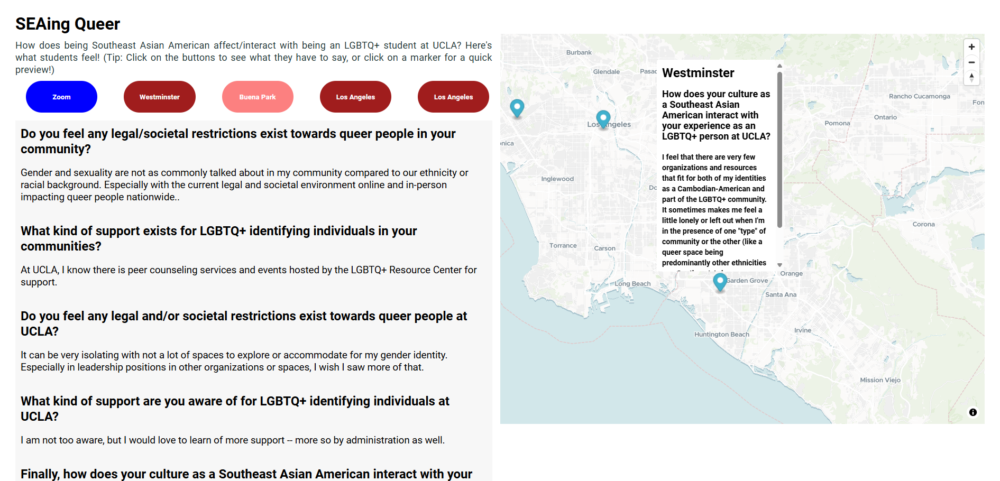

# SEAing Queer

SEAing Queer is a mapping project which aims to share the unique experiences of Southeast Asian LGBTQ+ UCLA students, through voluntary survey data.

## Table of Contents

* [Objectives](#objectives)
* [Who is being empowered](#who-is-being-empowered)
* [Tech Stack](#tech-stack)
* [Repurposing](#repurposing)
* [Features](#features)

## Objectives

With this project we hope to map out the different backgrounds of UCLA Southeast Asian American students including where they are from. With knowledge of their cultural identity we will also collect data on how they feel being at UCLA both as Southeast Asian Americans and part of the LGBTQ+ community. The data will be used to create a website that maps out the data of groups of individuals that are a part of both communities, and share their voices.

## Who is being empowered

We hope that our project will be used by UCLA organizations that specialize in working with the LGBTQ+ community, such as the Asian Pacific Coalition, Kabalikat Kore, and the UCLA Queer Alliance, in order to create more opportunities that cater towards Southeast Asian American students that can provide for their voices to be heard and recognized. The data collected by the survey will be utilized for the visualizations of the project and upkeep of the website will be coordinated with these organizations.

## Tech Stack

HTML, CSS, JS: Framework used to design and script the webpage
MapLibreGL: Used to generate map based on JSON data, along with markers and popups.
MapTiler: Used for API Key to produce map interface.
PapaParse: Used to parse data from Google Sheets into a JSON format for further JavaScript processing.

## Repurposing

This project can inform the creation, continuation, and implementation of support structures under the LGBTQ Campus Resource Center. Additionally, more identity/culture focused groups can improve their inclusivity by adapting their resources, events, and spaces accordingly. This research project will ideally provide meaningful insight into the experiences of members of an underrepresented group of people, both in culture and sexual/gender identity, which will challenge institutional and club-based structures to better serve their needs.

## Features

This webpage includes button popups for each surveyee, allowing viewers to read about their experiences. An accompanying map guides viewers to the surveyee's personal community along with markers for all other respondees.

